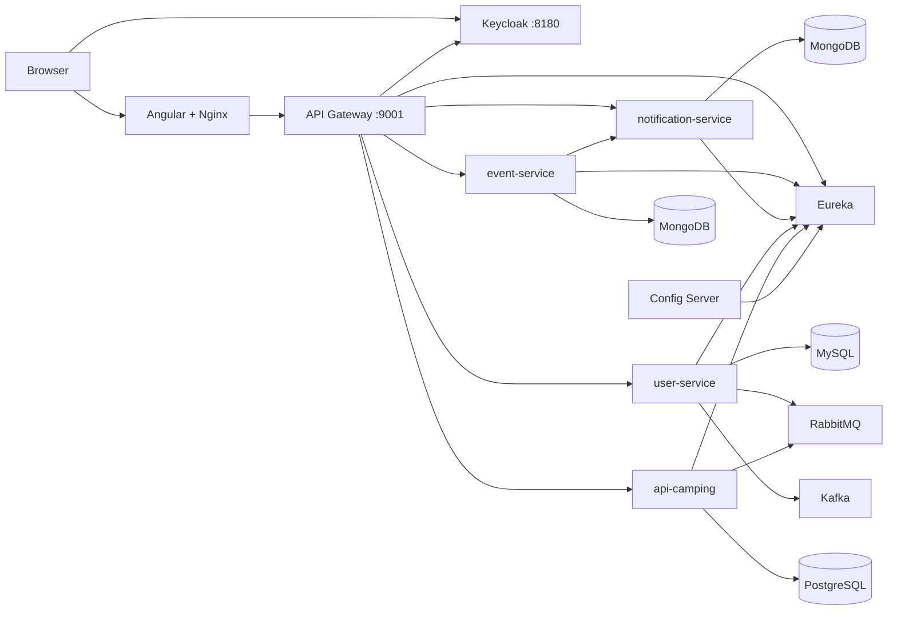

# CampConnect Team Deployment

This repository starts the full distributed application from the team GitHub
repositories. It builds every Java and Angular service from source, so no
prebuilt `target/*.jar` or `dist/` directory is required.

## Architecture

## Start

1. Copy `.env.example` to `.env`.
2. Replace every `change-me` and `replace-me` value.
3. Run `docker compose up --build -d`.
4. Check readiness with `docker compose ps`.

The first build downloads all Maven and npm dependencies and can take several
minutes. Stop with `docker compose down`. Add `-v` only when you intentionally
want to erase all database and Keycloak data.

## URLs

| Component | URL |
| --- | --- |
| Angular application | http://localhost:4200 |
| Gateway Swagger UI | http://localhost:9001/swagger-ui.html |
| Eureka dashboard | http://localhost:8761 |
| Keycloak console | http://localhost:8180 |
| RabbitMQ console | http://localhost:15672 |
| Config Server sample | http://localhost:8099/api-camping/default |

## Demo Accounts

These accounts are development fixtures imported into the `campconnect` realm:

| Username | Password | Realm roles |
| --- | --- | --- |
| `camp-admin` | `Admin123!` | `ADMIN`, `USER` |
| `organizer` | `Organizer123!` | `ORGANIZER`, `USER` |
| `camper` | `Camper123!` | `USER` |

Change or remove these accounts before any non-local deployment.

## API Surface

All frontend traffic uses the gateway:

- `GET /api/events/**` is public.
- Event creation and lifecycle mutations require `ADMIN` or `ORGANIZER`.
- Registration requires an authenticated user.
- `/api/notifications/**`, `/api/users/**`, and camping APIs require authentication.
- Swagger aggregates event, notification, and camping OpenAPI definitions.

Keycloak issues browser tokens with `http://localhost:8180` as issuer. The
gateway validates that issuer while loading signing keys from Keycloak's
Docker-internal URL. This avoids the common `localhost` container mismatch.

## Demonstration Scenarios

1. Sign in as `organizer`, create and publish an event, then verify it appears
   for logged-out visitors.
2. Sign in as `camper`, reserve a seat, and verify a persisted notification.
3. Fill event capacity, register another user, and demonstrate the waitlist.
4. Cancel a confirmed registration and demonstrate automatic waitlist promotion.
5. Postpone or cancel an event and show participant notifications.
6. Create/update a user to show RabbitMQ and Kafka events in service logs.

## Configuration and Secrets

`.env` is ignored by Git. The committed `.env.example` contains placeholders
only. Use sandbox Stripe/Cloudinary credentials for the camping service.
Credentials already committed historically in service repositories should be
rotated by their owners.

Environment variables in Compose intentionally override service files that
still reference `localhost`. Once all shared service configurations are cleaned
up, the same variables remain valid for CI/CD and cloud deployment.

The UserService readiness dependency uses the actuator liveness group, so an
unconfigured optional SMTP account does not block the gateway. Its aggregate
`/actuator/health` endpoint still reports mail connectivity for diagnostics.

## Repository Overrides

Every build accepts a repository URL and Git ref from `.env`. The default
gateway and frontend refs are integration branches until their upstream pull
requests are merged. After merge, use the organization repositories with
`main`.

## Troubleshooting

- Inspect a service with `docker compose logs -f <service>`.
- Rebuild one service with `docker compose up --build -d <service>`.
- If a host port is occupied, change its value in `.env`.
- A service marked `unhealthy` usually means a database, broker, or Config
  Server override is incorrect; inspect that service and its dependency logs.
