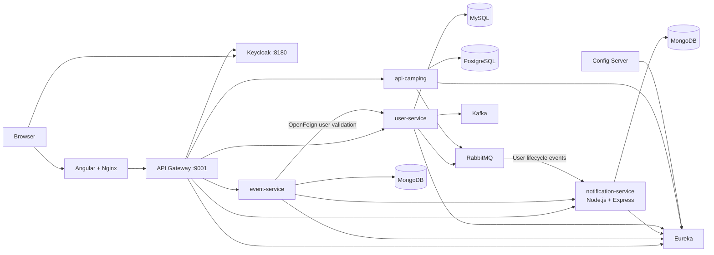

# CampConnect Team Deployment

This repository starts the full distributed application from the team GitHub
repositories. It builds the Java, Node.js, and Angular services from source, so
no prebuilt `target/*.jar`, `node_modules/`, or `dist/` directory is required.

## Architecture



## Start

1. Copy `.env.example` to `.env`.
2. Replace every `change-me` and `replace-me` value.
3. Run `docker compose up --build -d`.
4. Check readiness with `docker compose ps`.

The first build downloads all Maven and npm dependencies and can take several
minutes. Stop with `docker compose down`. Add `-v` only when you intentionally
want to erase all database and Keycloak data.

## URLs

| Component | URL |
| --- | --- |
| Angular application | http://localhost:4200 |
| Gateway Swagger UI | http://localhost:9001/swagger-ui.html |
| Eureka dashboard | http://localhost:8761 |
| Keycloak console | http://localhost:8180 |
| RabbitMQ console | http://localhost:15672 |
| Config Server sample | http://localhost:8099/api-camping/default |

## Demo Accounts

These accounts are development fixtures imported into the `campconnect` realm:

| Username | Password | Realm roles |
| --- | --- | --- |
| `camp-admin` | `Admin123!` | `ADMIN`, `USER` |
| `organizer` | `Organizer123!` | `ORGANIZER`, `USER` |
| `camper` | `Camper123!` | `USER` |

Change or remove these accounts before any non-local deployment.

## API Surface

All frontend traffic uses the gateway:

- `GET /api/events/**` is public.
- Event creation and lifecycle mutations require `ADMIN` or `ORGANIZER`.
- Registration requires an authenticated user.
- `/api/notifications/**`, `/api/users/**`, and camping APIs require authentication.
- Swagger aggregates event, notification, and camping OpenAPI definitions.

Keycloak issues browser tokens with `http://localhost:8180` as issuer. The
gateway validates that issuer while loading signing keys from Keycloak's
Docker-internal URL. This avoids the common `localhost` container mismatch.

## Demonstration Scenarios

1. Sign in as `organizer`, create and publish an event, then verify it appears
   for logged-out visitors.
2. Create a user in the teammate-owned UserService and verify that RabbitMQ
   asynchronously creates a persisted welcome notification.
3. Register that numeric user ID for an event and show Event Service using
   OpenFeign to validate it through Eureka before accepting the registration.
4. Try an unknown user ID and show the coherent `404` rejection from the
   cross-member synchronous call.
5. Update and delete the teammate user and show RabbitMQ creating a profile
   update notification and then cleaning up that user's notifications.
6. Fill event capacity, demonstrate the waitlist, then cancel a confirmed
   registration and show automatic waitlist promotion.
7. Postpone or cancel an event and show participant notifications.

Run the verified scenario with:

```powershell
.\scripts\demo-events-notifications.ps1
```

## Configuration and Secrets

`.env` is ignored by Git. The committed `.env.example` contains placeholders
only. Use sandbox Stripe/Cloudinary credentials for the camping service.
Credentials already committed historically in service repositories should be
rotated by their owners.

Environment variables in Compose intentionally override service files that
still reference `localhost`. Once all shared service configurations are cleaned
up, the same variables remain valid for CI/CD and cloud deployment.

The Event service uses Spring Cloud Config directly. The Node.js Notification
service loads the same centralized Spring property document over REST and maps
its port, MongoDB URI, Eureka URL, actuator path, and Swagger path. Environment
variables only supply deployment-specific values to those central properties.

The UserService readiness dependency uses the actuator liveness group, so an
unconfigured optional SMTP account does not block the gateway. Its aggregate
`/actuator/health` endpoint still reports mail connectivity for diagnostics.

## Repository Overrides

Every build accepts a repository URL and Git ref from `.env`. The committed
defaults use the reviewed organization `main` branches.

Each repository also has a pinned `*_REVISION` commit. This prevents Docker's
build cache from silently reusing stale source when a branch moves. Update the
ref and revision together whenever the deployment is intentionally upgraded.

## Git Workflow

Team changes use focused branches, pull requests, and typed commit messages
such as `feat:`, `fix:`, `test:`, and `docs:`. See
[CONTRIBUTING.md](CONTRIBUTING.md) for the shared commit rules and review
checklist.

## Troubleshooting

- Inspect a service with `docker compose logs -f <service>`.
- Rebuild one service with `docker compose up --build -d <service>`.
- If a host port is occupied, change its value in `.env`.
- A service marked `unhealthy` usually means a database, broker, or Config
  Server override is incorrect; inspect that service and its dependency logs.
