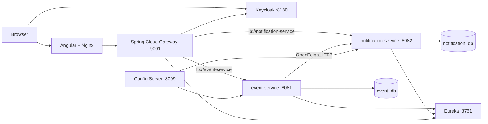

# Events and Notifications Defense Report

Status verified on June 9, 2026.

## 1. Your Exact Scope

Your individual technical scope is:

- `event-service`
- `notification-service`
- their MongoDB databases
- synchronous communication from Events to Notifications with OpenFeign
- their routes and role rules in the API Gateway
- their Config Server configuration
- their typed Angular API clients and Keycloak bearer-token integration
- their part of Docker Compose, Swagger, tests, Git history, and documentation

The team frontend pages for users, authentication, camping, and bookings belong
to your colleagues. Do not claim that you created those pages. Your frontend
contribution is the nonvisual Events/Notifications API integration layer.

### One-sentence presentation

> I implemented an advanced event lifecycle with capacity, registration,
> waitlisting and automatic promotion, plus a persisted notification center.
> Both services use MongoDB, register with Eureka, load centralized
> configuration, communicate synchronously through OpenFeign, and are protected
> by role-based Keycloak authorization at the API Gateway.

## 2. What Is Implemented

### Event service

- MongoDB CRUD
- categories and lifecycle statuses
- draft and publication control
- search and filtering
- upcoming and available event queries
- capacity and occupancy calculation
- confirmed registrations
- ordered waitlist
- duplicate registration rejection
- waitlist capacity enforcement
- automatic promotion after a confirmed registration is cancelled
- postponement with participant notifications
- cancellation with a reason and participant notifications
- guarded lifecycle transitions
- validation DTOs
- structured exception responses
- Swagger/OpenAPI
- unit and controller tests

### Notification service

- persisted MongoDB CRUD
- recipient, event, type, and read-state filtering
- unread count
- mark one notification as read
- mark all recipient notifications as read
- timestamps for creation, update, and read operations
- validation DTOs
- structured exception responses
- Swagger/OpenAPI
- unit and controller tests

### Platform integration

- Eureka discovery
- Config Server
- API Gateway routing with `lb://` service names
- Keycloak JWT validation
- centralized role conversion and authorization
- centralized Swagger documents
- Docker Compose with health checks and persistent volumes
- Angular typed API clients and bearer-token interceptor

## 3. Rubric Coverage

| Professor criterion | Current status | Evidence |
| --- | --- | --- |
| Individual Spring Boot CRUD | Complete | Events and Notifications both expose CRUD |
| Advanced domain | Complete | lifecycle, waitlist, promotion, occupancy, read state |
| MongoDB or PostgreSQL | Complete | separate MongoDB databases |
| Eureka | Complete | services and Gateway register/discover by name |
| Config Server | Complete | central properties for both services |
| API Gateway | Complete | `/api/events/**` and `/api/notifications/**` |
| API security | Complete at role level | Keycloak JWT and centralized Gateway rules |
| Git and documentation | Complete | focused commits, PRs, READMEs, this report |
| Docker Compose | Complete | full team stack with health dependencies |
| Frontend | Partial for your modules | API clients and Keycloak integration, no dedicated Events UI |
| Synchronous communication | Complete | OpenFeign Events to Notifications |
| Asynchronous communication | Missing for your two services | RabbitMQ/Kafka exist in team infrastructure but are not used here |
| Centralized Swagger | Complete | Gateway exposes Events and Notifications documents |
| CI/CD | Not implemented | possible bonus improvement |
| Monitoring | Not implemented | Prometheus/Grafana are possible improvements |
| Kubernetes/cloud deployment | Not implemented | possible bonus improvement |

Do not claim that every bonus criterion is complete. A precise answer is more
credible than an inflated one.

## 4. Architecture



### Request path

1. A client obtains a Keycloak access token.
2. The client sends an API request to port `9001`.
3. The Gateway validates the JWT signature and issuer.
4. Keycloak realm roles are converted to Spring authorities such as
   `ROLE_ORGANIZER`.
5. The Gateway applies the route-specific authorization rule.
6. The Gateway removes `/api` for Events and Notifications.
7. The request is load-balanced to the Eureka service name.
8. The service validates the DTO, executes business rules, and persists data.
9. Event operations create notification records through OpenFeign.

## 5. Event Domain Model

### Categories

- `ADVENTURE`
- `CAMPING_ACTIVITY`
- `GUIDED_TOUR`
- `SOCIAL_EVENT`
- `WELLNESS`
- `WORKSHOP`
- `EDUCATIONAL`
- `OTHER`

### Statuses

- `DRAFT`
- `SCHEDULED`
- `POSTPONED`
- `ONGOING`
- `COMPLETED`
- `CANCELLED`

### Main lifecycle

```text
DRAFT --publish--> SCHEDULED
SCHEDULED --postpone--> POSTPONED
SCHEDULED/POSTPONED --start--> ONGOING
ONGOING --complete--> COMPLETED
Eligible state --cancel--> CANCELLED
```

Invalid state transitions return HTTP `409 Conflict`.

### Computed fields

- `registeredCount`: confirmed participant count
- `waitlistCount`: waitlisted participant count
- `availableSeats`: `max(0, capacity - registeredCount)`
- `fullyBooked`: true when available seats are zero
- `occupancyRate`: confirmed registrations divided by capacity, from `0` to `1`

### Important business rules

1. End date must be after start date.
2. Registration requires a published future event.
3. Registration is only open for `SCHEDULED` or `POSTPONED`.
4. A participant cannot be both registered and waitlisted.
5. Duplicate registration returns `409`.
6. When capacity is full, the participant enters the waitlist if space exists.
7. When both capacity and waitlist are full, registration returns `409`.
8. Cancelling a confirmed registration promotes the first waitlisted person.
9. Capacity cannot be reduced below the confirmed registration count.
10. Waitlist capacity cannot be reduced below its current count.
11. An event with registrations cannot return to draft.
12. An event with registrations should be cancelled instead of deleted.
13. Ongoing or completed events cannot be deleted.
14. Cancelled events are automatically unpublished.

## 6. Notification Domain Model

### Notification types

- `EVENT_CREATED`
- `REGISTRATION_CONFIRMED`
- `WAITLIST_JOINED`
- `WAITLIST_PROMOTED`
- `REGISTRATION_CANCELLED`
- `EVENT_POSTPONED`
- `EVENT_CANCELLED`
- `EVENT_STARTED`
- `EVENT_COMPLETED`
- `EVENT_REMINDER`
- `GENERAL`

### Automatic notifications

| Event action | Recipient | Type |
| --- | --- | --- |
| Create event | organizer | `EVENT_CREATED` |
| Confirm registration | participant | `REGISTRATION_CONFIRMED` |
| Join waitlist | participant | `WAITLIST_JOINED` |
| Promotion | promoted participant | `WAITLIST_PROMOTED` |
| Cancel registration | participant | `REGISTRATION_CANCELLED` |
| Postpone event | confirmed and waitlisted participants | `EVENT_POSTPONED` |
| Cancel event | confirmed and waitlisted participants | `EVENT_CANCELLED` |
| Start event | confirmed and waitlisted participants | `EVENT_STARTED` |
| Complete event | confirmed and waitlisted participants | `EVENT_COMPLETED` |

Marking a notification as read is idempotent. Calling it again returns the
already-read record without creating another change.

## 7. Gateway Security Matrix

| Operation | Anonymous | USER | ORGANIZER | ADMIN |
| --- | --- | --- | --- | --- |
| Read normal Events endpoints | Allowed | Allowed | Allowed | Allowed |
| Read Event/Notification Feign aggregation | 401 | 403 | Allowed | Allowed |
| Register or cancel registration | 401 | Allowed | Allowed | Allowed |
| Create/update/delete/lifecycle Events | 401 | 403 | Allowed | Allowed |
| Read or mark Notifications | 401 | Allowed | Allowed | Allowed |
| Create/update/delete Notifications | 401 | 403 | Allowed | Allowed |

The newer team Gateway matrix also recognizes `CAMPER` and `SITE_OWNER` for
the colleague-owned user, camping, booking, and notification routes.

### 401 versus 403

- `401 Unauthorized`: no valid authentication was provided.
- `403 Forbidden`: authentication is valid, but the role is insufficient.

### Keycloak details

- realm: `campconnect`
- client: `campconnect-web`
- client type: public
- browser flow: Authorization Code with PKCE `S256`
- API validation: OAuth2 Resource Server JWT
- role claim: `realm_access.roles`
- authority conversion: `ORGANIZER` becomes `ROLE_ORGANIZER`

## 8. Main API Surface

### Events

| Method | Route | Purpose |
| --- | --- | --- |
| `GET` | `/api/events` | list and filter |
| `GET` | `/api/events/search?keyword=x` | text search |
| `GET` | `/api/events/upcoming` | future published events |
| `GET` | `/api/events/available` | events with seat/waitlist capacity |
| `GET` | `/api/events/{id}` | one event |
| `POST` | `/api/events` | create |
| `PUT` | `/api/events/{id}` | update |
| `DELETE` | `/api/events/{id}` | delete when permitted |
| `PATCH` | `/api/events/{id}/publish` | publish draft |
| `PATCH` | `/api/events/{id}/unpublish` | return scheduled event to draft |
| `POST` | `/api/events/{id}/registrations` | register or waitlist |
| `DELETE` | `/api/events/{id}/registrations/{participantId}` | cancel registration |
| `PATCH` | `/api/events/{id}/postpone` | change dates |
| `PATCH` | `/api/events/{id}/cancel` | cancel with reason |
| `PATCH` | `/api/events/{id}/status?status=ONGOING` | guarded status transition |
| `GET` | `/api/events/{id}/availability` | occupancy metrics |
| `GET` | `/api/events/with-notification` | secured Feign aggregation demo |

### Notifications

| Method | Route | Purpose |
| --- | --- | --- |
| `GET` | `/api/notifications` | list/filter |
| `GET` | `/api/notifications/{id}` | one record |
| `POST` | `/api/notifications` | create |
| `PUT` | `/api/notifications/{id}` | update content |
| `DELETE` | `/api/notifications/{id}` | delete |
| `PATCH` | `/api/notifications/{id}/read` | mark one read |
| `PATCH` | `/api/notifications/recipient/{id}/read-all` | mark all read |
| `GET` | `/api/notifications/recipient/{id}/unread-count` | unread count |

Filters are `recipientId`, `eventId`, `read`, and `type`.

## 9. Demo Preparation

### The day before

1. Pull the latest deployment `main`.
2. Start Docker Desktop.
3. Check that ports `4200`, `8180`, `8761`, `8099`, and `9001` are free.
4. Start the stack once to warm Maven, npm, and Docker caches.
5. Run the automated scenario once.
6. Keep this report available locally.
7. Do not run `docker compose down -v`, because `-v` erases demo data.

### Start commands

```powershell
cd C:\Users\ihebb\Desktop\AWD2026\campconnect-deployment
docker compose up --build -d
docker compose ps
```

Wait until the required services show `healthy`.

### Useful URLs

- Frontend: http://localhost:4200
- Gateway Swagger: http://localhost:9001/swagger-ui.html
- Eureka: http://localhost:8761
- Config Server Events: http://localhost:8099/event-service/default
- Config Server Notifications: http://localhost:8099/notification-service/default
- Keycloak: http://localhost:8180

### Demo accounts

| Username | Password | Roles |
| --- | --- | --- |
| `camp-admin` | `Admin123!` | `ADMIN`, `USER` |
| `organizer` | `Organizer123!` | `ORGANIZER`, `USER` |
| `camper` | `Camper123!` | `USER` |

These are local demonstration fixtures, not production credentials.

## 10. Recommended 12-Minute Showcase

Run:

```powershell
Set-ExecutionPolicy -Scope Process Bypass
.\scripts\demo-events-notifications.ps1
```

The script stops immediately if any expected result is wrong.

### Minute 0-1: Explain scope

Say:

> My two modules are Events and Notifications. The Events service owns the
> event aggregate and business lifecycle. The Notification service owns
> persisted user messages and read state. They have separate MongoDB databases.

### Minute 1-2: Infrastructure

Open Eureka and Config Server.

Say:

> Eureka removes hard-coded discovery from the Gateway. Config Server
> centralizes ports, database URLs, Eureka settings, actuator, Swagger, and the
> notification endpoint. In Compose, configuration import is fail-fast.

Expected evidence:

- Eureka responds.
- Config Server returns both application names.
- Gateway health is HTTP 200.
- both OpenAPI documents are available.

### Minute 2-3: Keycloak and Gateway security

The script obtains all three role tokens, then proves:

- public Event read returns `200`
- anonymous Event creation returns `401`
- USER Event creation returns `403`
- anonymous Notification read returns `401`

Say:

> Authentication proves identity. Authorization decides permissions. The
> Gateway extracts realm roles from the JWT and applies endpoint-level rules.

### Minute 3-4: Create an event and validation

The organizer creates a future published event with:

- capacity `1`
- waitlist capacity `2`
- status automatically set to `SCHEDULED`

Then an invalid request returns `400` with `validationErrors`.

Say:

> Controllers receive DTOs, not persistence entities. Jakarta validation
> handles field constraints, while the service handles cross-field and domain
> rules such as date order and status transitions.

### Minute 4-7: Advanced event scenario

The script:

1. confirms the camper
2. waitlists the organizer at position 1
3. waitlists the admin at position 2
4. rejects a duplicate registration with `409`
5. shows one confirmed and two waitlisted participants
6. cancels the camper registration
7. promotes the organizer automatically

Say:

> I use a `LinkedHashSet` so identifiers stay unique while preserving waitlist
> insertion order. Cancelling a confirmed registration removes the first
> waitlisted identifier and moves it into the confirmed set.

### Minute 7-8: Feign communication

The script proves that registration generated a persisted
`REGISTRATION_CONFIRMED` notification, and the secured aggregation endpoint
returns both service responses.

Say:

> This is synchronous OpenFeign communication. The event operation calls the
> notification API over HTTP. Notification failures are caught and logged so a
> temporary notification outage does not roll back the event operation.

### Minute 8-9: Lifecycle protection

The script:

- rejects deletion while registrations exist
- postpones the event
- cancels it with a reason
- automatically unpublishes it

Say:

> These are domain operations, not generic field updates. Each operation
> enforces a valid state and creates participant notifications.

### Minute 9-10: Notification CRUD/read state

The script:

- counts unread notifications
- marks all organizer notifications as read
- proves unread count becomes zero
- proves USER cannot create notifications
- proves ORGANIZER can create one

### Minute 10-11: Persistence

The script queries both MongoDB containers and proves:

- the event document exists in `event_db`
- related notification documents exist in `notification_db`

Say:

> MongoDB `_id` is physically an ObjectId, while Spring Data exposes it as a
> Java String in the API model.

### Minute 11-12: Tests and honest conclusion

State:

- Event service: 9 tests passing
- Notification service: 5 tests passing
- Gateway: 11 tests passing
- automated live scenario: passing
- total relevant backend automated tests: 25

Finish with:

> The principal remaining improvement is asynchronous event delivery through
> RabbitMQ with an outbox and retry strategy. Current service communication is
> synchronous and best-effort.

## 11. Expected Automated Scenario Results

| Step | Expected result |
| --- | --- |
| health and documents | HTTP 200 |
| anonymous create Event | 401 |
| USER create Event | 403 |
| ORGANIZER create Event | 201 |
| invalid Event | 400 plus field errors |
| first registration | `CONFIRMED` |
| next registrations | `WAITLISTED`, positions 1 and 2 |
| duplicate | 409 |
| cancel confirmed registration | first waitlisted promoted |
| delete with registrations | 409 |
| postpone | `POSTPONED` |
| cancel Event | `CANCELLED`, unpublished |
| unread count | greater than zero |
| mark all read | positive `updatedCount` |
| USER create Notification | 403 |
| ORGANIZER create Notification | 201 |
| Mongo evidence | event count 1, notification count greater than 0 |

## 12. Manual Recovery Commands

### Inspect service state

```powershell
docker compose ps
docker compose logs --tail 100 event-service
docker compose logs --tail 100 notification-service
docker compose logs --tail 100 api-gateway
```

### Rebuild one service

```powershell
docker compose up --build -d event-service
docker compose up --build -d notification-service
docker compose up --build -d api-gateway
```

### Check MongoDB

```powershell
docker exec -it campconnect-event-mongodb-1 mongosh event_db
docker exec -it campconnect-notification-mongodb-1 mongosh notification_db
```

Inside `mongosh`:

```javascript
db.events.find().sort({ createdAt: -1 }).limit(3)
db.notifications.find().sort({ createdAt: -1 }).limit(10)
```

### Run tests

```powershell
cd ..\event-service
mvn test

cd ..\notification-service
mvn test

cd ..\team-api-gateway
.\mvnw.cmd test
```

## 13. High-Probability Questions and Answers

### Architecture

**1. Why microservices instead of one application?**

Events and Notifications have separate responsibilities, data, deployment
cycles, and scaling needs. The separation also demonstrates discovery,
centralized routing, centralized security, and service communication.

**2. Does each service own its database?**

Yes. Events owns `event_db`; Notifications owns `notification_db`. One service
does not directly query the other service's database.

**3. Why is database ownership important?**

It reduces coupling. A service can change its persistence model without
requiring another service to understand its collections.

**4. What is the API Gateway's job?**

It provides one external API entry point, routes by path, validates JWTs,
applies roles, manages CORS, and aggregates Swagger documents.

**5. Why does the Gateway use WebFlux?**

Spring Cloud Gateway is reactive. Nonblocking routing lets a small number of
threads handle many concurrent network requests.

**6. What does `lb://event-service` mean?**

It tells Spring Cloud LoadBalancer to resolve instances registered under the
Eureka service name `event-service`.

**7. Why strip `/api`?**

External clients use `/api/events`, but the service controller exposes
`/events`. `stripPrefix(1)` removes the Gateway-only prefix.

**8. Is the frontend the security authority?**

No. Hiding buttons is only user experience. The Gateway is the enforcement
point because clients can call APIs without the frontend.

**9. What is a health check?**

It is an endpoint or command used by Compose to determine whether a dependency
is ready, not merely whether its process exists.

**10. What happens if Eureka is unavailable?**

Existing cached discovery data may work temporarily, but new resolution and
registration are affected. The stack starts Eureka before dependent services.

### Events and domain logic

**11. Why is this more than CRUD?**

It contains state transitions, publication rules, computed capacity,
registration, ordered waitlisting, automatic promotion, cancellation reasons,
participant notifications, and conflict handling.

**12. Why use enums for category and status?**

Enums restrict the domain to known values and allow validation during JSON
deserialization instead of accepting inconsistent strings.

**13. How is waitlist order preserved?**

`LinkedHashSet` preserves insertion order and prevents duplicate identifiers.

**14. Why not use a List?**

A List preserves order but permits duplicates. A Set naturally enforces the
uniqueness rule.

**15. How does promotion work?**

When a confirmed participant cancels, the service removes the first identifier
from the ordered waitlist and inserts it into confirmed participants.

**16. What if the event and waitlist are both full?**

The service returns HTTP `409 Conflict`.

**17. Why 409 and not 400?**

The request format is valid, but it conflicts with current resource state.

**18. What if the end date is before the start date?**

The service rejects it with HTTP `400 Bad Request`.

**19. Can a cancelled event accept registration?**

No. Registration only permits published `SCHEDULED` or `POSTPONED` future
events.

**20. Can an event with registrations be unpublished?**

No. Returning it to draft would invalidate existing participant expectations.

**21. Why prevent deleting an event with registrations?**

Cancellation preserves history and allows participants to be notified. Delete
would silently remove the business record.

**22. What are valid manual status transitions?**

`SCHEDULED` or `POSTPONED` to `ONGOING`, then `ONGOING` to `COMPLETED`.

**23. How is occupancy calculated?**

Confirmed count divided by capacity, capped at `1`. Waitlisted users are not
included.

**24. Does postponement remove registrations?**

No. It changes dates and status, keeps registrations, and notifies confirmed
and waitlisted participants.

**25. Which operations do not generate automatic notifications?**

Generic update, publish, unpublish, and delete do not currently create them.

### Notifications

**26. Is Notification service real CRUD?**

Yes: create, read one/list, update content, and delete are persisted in MongoDB.

**27. Why persist notifications?**

Users need history, unread counts, and read state across sessions and restarts.

**28. What does mark-all-read return?**

`updatedCount`, the number of previously unread records changed.

**29. Is mark-as-read idempotent?**

Yes. Repeating it does not create a second record or reset the timestamp.

**30. What filters are supported?**

Recipient ID, event ID, read state, and notification type.

**31. How are notifications ordered?**

The repository returns newest first by `createdAt`.

**32. Does updating notification content reset read state?**

No. The content and `updatedAt` change; read state remains unchanged.

**33. Why have `actionUrl`?**

It gives the frontend a destination related to the message, such as an Event
details route.

**34. Why separate created, updated, and read timestamps?**

They represent different audit events and support troubleshooting or analytics.

**35. Can a notification exist without an event?**

Yes. `eventId` is optional for general platform messages.

### MongoDB and persistence

**36. Why MongoDB for Events?**

The Event aggregate contains nested sets and evolves with domain fields.
Document persistence maps naturally to that aggregate for this project.

**37. Why MongoDB for Notifications?**

Notifications are independent append-heavy documents with flexible metadata
and simple recipient/event queries.

**38. Which fields are indexed?**

Events index category, status, and start time. Notifications index recipient ID
and event ID.

**39. Is the API ID a String or ObjectId?**

Java exposes it as `String`; MongoDB stores the generated `_id` as `ObjectId`.

**40. How does data survive container restart?**

Docker named volumes persist `/data/db` outside the container lifecycle.

**41. Are there MongoDB transactions?**

No. Each operation updates one aggregate document. There is also no distributed
transaction between Event and Notification services.

**42. What is a scaling limitation of embedded participant IDs?**

Very large events would produce large documents and contention. A separate
Registration collection would scale better.

**43. Is concurrency completely protected?**

No. Concurrent last-seat registration can race. A production version should
use optimistic locking with `@Version` or an atomic conditional Mongo update.

### Validation and errors

**44. Why use DTOs instead of exposing entities?**

DTOs define the API contract, isolate persistence, apply validation, and avoid
accidentally exposing internal fields.

**45. What validation technology is used?**

Jakarta Bean Validation annotations such as `@NotBlank`, `@Size`, `@Min`,
`@Max`, and `@DecimalMin`.

**46. Where is cross-field validation performed?**

In the service layer, for example end date after start date.

**47. What does the global exception handler provide?**

A consistent body with timestamp, HTTP status, error, message, path, and
field-level validation errors.

**48. Why not return 200 with an error message?**

HTTP status codes allow clients, monitoring, and tests to distinguish success
from failure without parsing custom text.

### Keycloak and security

**49. What is JWT?**

A signed token containing identity and claims. The Gateway verifies the
signature, issuer, expiration, and roles.

**50. Does the Gateway call Keycloak for every request?**

It validates JWT signatures using Keycloak's public keys. It does not need a
password exchange for every API request.

**51. Why separate issuer URI and JWK Set URI?**

The token issuer is browser-visible `localhost:8180`, while the container can
retrieve signing keys through internal DNS `keycloak:8080`.

**52. What is PKCE?**

Proof Key for Code Exchange protects public clients from authorization-code
interception. The Angular client uses `S256`.

**53. Why is the client public?**

A browser cannot safely store a client secret.

**54. Where are roles stored?**

In Keycloak realm roles, delivered in the JWT `realm_access.roles` claim.

**55. Why convert roles?**

Spring's `hasRole("ADMIN")` expects authority `ROLE_ADMIN`.

**56. Why centralize security?**

It creates one consistent policy and avoids duplicating role rules in every
service.

**57. Are direct service ports secure in this local Compose file?**

They are exposed for development and diagnostics, so direct calls can bypass
the Gateway. In production, only Gateway should be public and service ports
should remain private.

**58. Can a USER query another recipient's notifications?**

The current implementation enforces roles, not resource ownership. A stronger
version would derive the recipient from JWT `sub` or permit arbitrary IDs only
for administrators.

**59. Is registration tied to the JWT subject?**

Not yet. The request supplies `participantId`. A stronger version would ignore
that field for normal users and use the authenticated `sub`.

**60. Why secure the Feign aggregation endpoint separately?**

It includes notification data, so it must not inherit the broad public Event
GET rule. It requires `ORGANIZER` or `ADMIN`.

### Communication

**61. What is OpenFeign?**

A declarative HTTP client. A Java interface and Spring annotations define the
remote Notification API.

**62. Is the communication synchronous?**

Yes. The Event request waits for the Notification HTTP call to return or fail.

**63. What is the benefit of synchronous communication here?**

It is easy to understand and gives immediate notification creation during the
business operation.

**64. What is the disadvantage?**

It adds latency and runtime coupling to Notification service availability.

**65. What happens when Notification service is down?**

The Event service catches the runtime exception, logs a warning, and continues
the Event operation. The result may be a missing notification.

**66. Why catch the Feign exception?**

Notification is treated as a secondary side effect; the main Event transaction
should remain available.

**67. Is RabbitMQ used between your services?**

No. Do not claim it is. The planned improvement is to publish domain events
asynchronously.

**68. How would you add RabbitMQ correctly?**

Persist the Event and an outbox record atomically, publish from the outbox,
consume idempotently in Notification service, retry failures, and use a dead
letter queue.

**69. Why is an outbox better than just calling RabbitTemplate after save?**

Without an outbox, the database save can succeed while publishing fails,
causing lost events.

### Eureka and Config Server

**70. What does Eureka provide?**

Service registration and discovery by logical application name.

**71. What does Config Server provide?**

Centralized environment-aware configuration outside service binaries.

**72. What does fail-fast mean?**

In the team Compose environment, Events and Notifications should stop startup
if required central configuration cannot be loaded.

**73. Can environment variables override central values?**

Yes. Config properties use environment placeholders for deployment-specific
values such as MongoDB and Eureka URLs.

### Testing, Docker, Git, and frontend

**74. What kinds of tests exist?**

Mockito service tests, MockMvc validation tests, WebFlux Gateway security tests,
and the live end-to-end PowerShell showcase.

**75. Why mock repositories in unit tests?**

It isolates business rules, runs quickly, and makes edge cases deterministic.

**76. What does the controller test verify?**

Invalid JSON contracts produce structured HTTP 400 responses with field errors.

**77. What does the Gateway test verify?**

Public access, 401/403 behavior, allowed roles, and Keycloak role conversion.

**78. How many related backend tests currently pass?**

25: 9 Events, 5 Notifications, and 11 Gateway.

**79. Why pin Git revisions in Compose?**

Branch names move. A commit SHA makes a build reproducible and prevents stale
Docker cache from silently using older source.

**80. What did you add to the frontend?**

Typed Event and Notification models, API services using relative Gateway URLs,
Keycloak initialization, and a bearer-token interceptor. I did not replace the
team's routed UI.

## 14. Questions Where You Must Be Honest

### "Do you use RabbitMQ between Events and Notifications?"

Answer:

> No. My implemented communication is synchronous OpenFeign. RabbitMQ and Kafka
> exist in the team stack, but asynchronous communication for these two
> services remains an improvement. I would implement it with an outbox,
> idempotent consumer, retry, and dead-letter queue.

### "Can a user only read their own notifications?"

Answer:

> The current Gateway enforces application roles, but not record ownership.
> The next security hardening step is to derive the recipient from token `sub`
> and reserve arbitrary recipient queries for administrators.

### "Are the microservices impossible to call directly?"

Answer:

> Not in local development because diagnostic host ports are published. In
> production, the services would be private inside the network and only the
> Gateway would be exposed.

### "What if Notification service fails after Event save?"

Answer:

> The Event succeeds and the notification may be missing because Feign failure
> is best-effort. RabbitMQ plus an outbox would provide eventual delivery.

### "Does the solution handle simultaneous registration perfectly?"

Answer:

> The domain rule is implemented, but there is no optimistic lock or atomic
> seat reservation yet. That is the main concurrency hardening improvement.

## 15. What Not to Say

- Do not say Events-to-Notifications is asynchronous.
- Do not say RabbitMQ is used by your two modules.
- Do not say users are restricted to only their own records.
- Do not say all service ports are production-secure.
- Do not say there is a distributed transaction.
- Do not say the frontend contains your Events dashboard.
- Do not claim CI/CD, Kubernetes, cloud deployment, or monitoring.
- Do not claim MongoDB queries are fully optimized; some filters run in memory.

## 16. Strong Improvement Roadmap

1. Add RabbitMQ domain events with transactional outbox.
2. Enforce recipient and participant ownership from JWT `sub`.
3. Remove direct service host ports outside development.
4. Add optimistic locking or atomic registration updates.
5. Move registrations to a separate collection for large events.
6. Replace in-memory filtering with indexed Mongo repository queries.
7. Add Testcontainers integration tests.
8. Add CI with Maven, Angular, Compose validation, and image scanning.
9. Add Prometheus metrics, Grafana dashboards, tracing, and alerting.
10. Add Kubernetes manifests and cloud deployment.

## 17. Final Presentation Checklist

- Docker Desktop is running.
- `docker compose ps` shows healthy services.
- Gateway Swagger opens.
- Eureka opens.
- Config Server URLs return JSON.
- demo credentials work.
- PowerShell execution policy is set for the current process.
- the automated scenario passes.
- you can explain `401`, `403`, `400`, and `409`.
- you can draw the request path without reading.
- you can explain why waitlist order uses `LinkedHashSet`.
- you can explain synchronous Feign failure behavior.
- you can state the RabbitMQ gap honestly.
- you know your exact scope and do not claim colleague UI modules.

