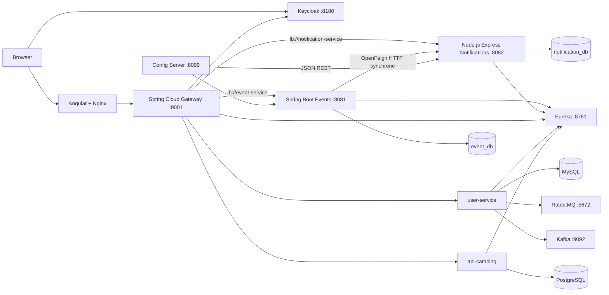
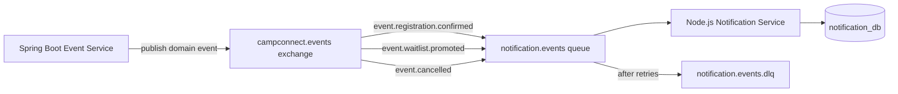

# Rapport de conformite aux criteres AWD

Date de verification: 10 juin 2026

Projet: CampConnect

Perimetre principal de Iheb:

- `event-service`: Spring Boot et MongoDB
- `notification-service`: Node.js, Express, Mongoose et MongoDB
- integration de ces services avec Eureka, Config Server, API Gateway,
  Keycloak, Angular et Docker Compose
- communication synchrone Events vers Notifications avec OpenFeign

## 1. Conclusion executive

Le projet couvre correctement la majorite des criteres obligatoires:

- microservice individuel Spring Boot avec CRUD et metier avance
- microservice collaboratif avec technologie avancee et MongoDB
- Eureka
- Config Server
- API Gateway
- securite centralisee Keycloak avec roles
- Git, pull requests et documentation
- Docker Compose
- integration frontend avec les APIs
- communication synchrone OpenFeign

Le principal risque restant concerne la communication asynchrone.

RabbitMQ et Kafka sont bien demarres dans l'infrastructure. Le `user-service`
declare des exchanges, queues, topics, producteurs et consommateurs. Cependant,
les consommateurs actuellement connectes appartiennent tous au meme
`user-service`. Cela prouve une gestion asynchrone interne, mais pas encore une
communication entre deux microservices differents.

Il ne faut donc pas affirmer que Events et Notifications communiquent avec
RabbitMQ. Leur communication actuelle est synchrone avec OpenFeign.

## 2. Tableau de conformite

| Critere | Etat | Preuve actuelle | Risque ou action |
| --- | --- | --- | --- |
| Microservice individuel Spring Boot CRUD | Complet | `event-service` | Aucun blocage |
| Comprehension du code et Q/A | Prepare | rapport de defense avec 88 questions | Reviser les reponses |
| Microservice collaboratif avance | Complet | Notifications en Node.js/Express | Aucun blocage |
| MongoDB ou PostgreSQL | Complet | `event_db`, `notification_db`, PostgreSQL Camping | Aucun blocage |
| Eureka | Complet | tous les services sont enregistres | Savoir expliquer `lb://` |
| Config Server | Complet | configurations Events et Notifications | Savoir expliquer l'adaptateur Node |
| API Gateway | Complet | routage centralise sur le port 9001 | Aucun blocage |
| Securite des APIs | Complet au niveau des roles | Keycloak et regles Gateway | Ownership des ressources non implemente |
| Git et documentation | Complet | commits, branches, PRs, READMEs, rapports | Continuer les commits significatifs |
| Docker Compose | Complet | stack equipe avec health checks | Ne pas utiliser `down -v` avant la demo |
| Frontend | Complet au niveau equipe, partiel pour Events | UI equipe plus clients API Events/Notifications | Pas de page Events dediee attribuable a Iheb |
| Communication synchrone | Complet | OpenFeign Events vers Notifications | Plusieurs scenarios disponibles |
| Communication asynchrone interservices | Manquant | RabbitMQ existe, mais un seul service produit et consomme | Priorite avant soutenance |
| Kafka | Bonus partiel | topics et consumers du `user-service` | Pas une communication interservices |

## 3. Architecture actuelle



### Chemin d'une requete

1. Angular obtient un access token depuis Keycloak.
2. Angular envoie la requete vers l'API Gateway.
3. La Gateway valide la signature, l'issuer, l'expiration et les roles JWT.
4. La Gateway applique les permissions selon le chemin et la methode HTTP.
5. La Gateway demande a Eureka une instance du service cible.
6. La requete est transmise au microservice.
7. Le service valide le contrat, execute le metier et persiste les donnees.
8. Pour certaines actions Event, OpenFeign appelle Notification en HTTP.

## 4. Travail individuel: Event Service

### Technologie

- Java 17
- Spring Boot
- Spring Data MongoDB
- Spring Cloud OpenFeign
- Spring Cloud Config
- Eureka Client
- Jakarta Validation
- Springdoc OpenAPI

### CRUD obligatoire

| Operation | Methode | Endpoint |
| --- | --- | --- |
| Create | `POST` | `/api/events` |
| Read all | `GET` | `/api/events` |
| Read one | `GET` | `/api/events/{id}` |
| Update | `PUT` | `/api/events/{id}` |
| Delete | `DELETE` | `/api/events/{id}` |

### Valeur metier au-dela du CRUD

- brouillon et publication
- categories et statuts
- recherche et filtres
- evenements futurs et disponibles
- capacite calculee
- inscriptions confirmees
- liste d'attente ordonnee
- rejet des doublons
- promotion automatique du premier participant en attente
- report d'un evenement
- annulation avec motif
- transitions de statut controlees
- interdiction de suppression lorsqu'il existe des inscriptions
- notifications automatiques liees aux operations metier

### Pourquoi ce service satisfait le travail individuel

Il s'agit bien d'un microservice Spring Boot autonome avec CRUD, base MongoDB,
validation, gestion d'erreurs, tests, documentation OpenAPI et logique metier
non triviale.

## 5. Travail d'equipe: Notification Service

### Technologie avancee

- Node.js
- Express
- Mongoose
- MongoDB
- Swagger UI
- Eureka via API REST
- Config Server via document JSON REST

### CRUD collaboratif

| Operation | Methode | Endpoint |
| --- | --- | --- |
| Create | `POST` | `/api/notifications` |
| Read all | `GET` | `/api/notifications` |
| Read one | `GET` | `/api/notifications/{id}` |
| Update | `PUT` | `/api/notifications/{id}` |
| Delete | `DELETE` | `/api/notifications/{id}` |

### Fonctions supplementaires

- filtrage par destinataire
- filtrage par evenement
- filtrage par type
- filtrage par etat lu/non lu
- compteur de notifications non lues
- marquage individuel comme lu
- marquage global comme lu
- timestamps de creation, modification et lecture
- validation centralisee des contrats
- gestion centralisee des erreurs Express

### Point important pour la soutenance

OpenFeign n'oblige pas le service distant a etre developpe avec Spring Boot.
Feign est un client HTTP. Le serveur distant peut etre en Node.js tant qu'il
respecte les memes endpoints, corps JSON et codes HTTP.

## 6. Eureka

### Ce qui est implemente

- Gateway, Events, Notifications, Users, Camping et Config Server sont
  enregistres dans Eureka.
- La Gateway utilise des URI logiques comme `lb://event-service`.
- Event utilise le nom `notification-service` lorsqu'aucune URL directe n'est
  configuree.
- Le service Node s'enregistre avec l'API REST Eureka et envoie des heartbeats.

### Demonstration

Ouvrir:

```text
http://localhost:8761
```

Montrer au minimum:

- `EVENT-SERVICE`
- `NOTIFICATION-SERVICE`
- `APIGATEWAY`
- `USER-SERVICE`
- `API-CAMPING`
- `CONFIG-SERVER`

### Reponse orale

> Eureka remplace les adresses physiques par des noms logiques. La Gateway et
> les clients peuvent decouvrir une instance sans connaitre son IP ou son port
> de conteneur.

## 7. Config Server

### Ce qui est centralise

- ports
- URI MongoDB
- URL Eureka
- endpoint Notification utilise par Event
- actuator
- Swagger/OpenAPI

### Demonstration

```text
http://localhost:8099/event-service/default
http://localhost:8099/notification-service/default
```

### Particularite Node.js

Event importe Spring Cloud Config nativement. Notification lit le document JSON
du Config Server, fusionne les property sources, resout les placeholders
Spring comme `${MONGODB_URI:...}`, puis donne la priorite aux variables
d'environnement.

## 8. API Gateway

### Routes principales

| Route publique | Service cible |
| --- | --- |
| `/api/events/**` | `event-service` |
| `/api/notifications/**` | `notification-service` |
| `/api/users/**` | `user-service` |
| `/api/site-camping/**` | `api-camping` |
| `/api/inscriptionsite/**` | `api-camping` |

### Fonctions centralisees

- routage
- decouverte Eureka
- suppression du prefixe `/api` pour Events et Notifications
- securite JWT
- conversion des roles Keycloak
- CORS
- aggregation Swagger

### Swagger centralise

```text
http://localhost:9001/swagger-ui.html
```

Documents:

- `/openapi/events`
- `/openapi/notifications`
- `/openapi/users`
- `/openapi/camping`

## 9. Securite Keycloak

### Flux

1. L'utilisateur s'authentifie dans Keycloak.
2. Keycloak delivre un JWT.
3. Angular ajoute `Authorization: Bearer <token>`.
4. La Gateway valide le JWT.
5. `realm_access.roles` est converti en autorites Spring.
6. La Gateway autorise ou refuse la requete.

### Exemples de regles

| Action | Anonyme | USER | ORGANIZER | ADMIN |
| --- | --- | --- | --- | --- |
| Lire les Events publics | 200 | 200 | 200 | 200 |
| Creer un Event | 401 | 403 | 201 | 201 |
| S'inscrire a un Event | 401 | autorise | autorise | autorise |
| Lire ses Notifications | 401 | autorise | autorise | autorise |
| Creer une Notification | 401 | 403 | 201 | 201 |
| Lire l'agregation Feign | 401 | 403 | 200 | 200 |

### Limite a reconnaitre

La Gateway controle actuellement les roles, mais pas toujours l'ownership.
Par exemple, un USER authentifie peut fournir un autre `recipientId`. Une
version plus forte utiliserait le claim JWT `sub`.

## 10. Git et documentation

### Elements disponibles

- commits reguliers et significatifs
- branches de fonctionnalite
- pull requests
- revision exacte de chaque service epinglee dans Compose
- README par service
- documentation de deploiement
- rapport de defense
- script de demonstration automatise

### Pull requests importantes

- Notification Node.js:  
  https://github.com/leaderscampconnect/notification-service/pull/4
- Deploiement Notification Node.js:  
  https://github.com/leaderscampconnect/campconnect-deployment/pull/8
- Securisation Gateway de l'agregation:  
  https://github.com/leaderscampconnect/api-gateway/pull/5
- Package de defense:  
  https://github.com/leaderscampconnect/campconnect-deployment/pull/6

### Pourquoi epingler les revisions

Une branche `main` peut changer. Une revision Git exacte rend le build
reproductible et empeche Docker d'utiliser silencieusement une ancienne version
mise en cache.

## 11. Docker Compose

La stack contient:

- frontend Angular/Nginx
- API Gateway
- Keycloak
- Eureka
- Config Server
- Event Service
- Notification Service
- User Service
- Camping Service
- deux MongoDB
- MySQL
- PostgreSQL
- RabbitMQ
- Kafka

Les services critiques possedent des health checks et des dependances de
demarrage.

### Commandes

```powershell
cd C:\Users\ihebb\Desktop\AWD2026\campconnect-deployment
docker compose up --build -d
docker compose ps
docker compose logs --tail 100 notification-service
```

Ne pas executer `docker compose down -v` avant la soutenance. L'option `-v`
supprime les volumes de donnees.

## 12. Frontend

### Contribution equipe

Le frontend Angular de l'equipe contient les pages utilisateurs, camping,
reservations et authentification.

### Contribution Events et Notifications

- modeles TypeScript
- `EventApiService`
- `NotificationApiService`
- appels vers `/api/events` et `/api/notifications`
- initialisation Keycloak
- interceptor Bearer token

### Limite

Il n'existe pas actuellement de tableau de bord Events complet attribuable a
Iheb. Il faut presenter l'integration API sans affirmer avoir cree toutes les
pages de l'equipe.

## 13. Communication synchrone avec OpenFeign

### Implementation

`event-service` contient un `NotificationClient` annote `@FeignClient`.

Il appelle:

- `POST /notifications`
- `GET /notifications`

La requete Event attend la reponse HTTP de Notification. Il s'agit donc d'une
communication synchrone.

### Scenario synchrone 1: inscription confirmee

1. Creer un Event publie avec une place.
2. Inscrire un participant.
3. Event enregistre le participant.
4. Feign appelle Notification.
5. Une notification `REGISTRATION_CONFIRMED` est persistee.
6. Lire la notification depuis la Gateway.

Resultat attendu:

- inscription `CONFIRMED`
- notification presente dans `notification_db`

### Scenario synchrone 2: liste d'attente

1. Remplir la capacite de l'Event.
2. Inscrire un deuxieme participant.
3. Le participant rejoint la waitlist.
4. Feign cree `WAITLIST_JOINED`.

Resultat attendu:

- statut `WAITLISTED`
- position de liste d'attente
- notification persistee

### Scenario synchrone 3: promotion automatique

1. Annuler l'inscription confirmee.
2. Event retire le participant.
3. Le premier participant en attente est promu.
4. Feign cree `WAITLIST_PROMOTED`.

Resultat attendu:

- promotion automatique
- ordre de la waitlist conserve
- notification persistee

### Scenario synchrone 4: report ou annulation

1. Reporter ou annuler un Event.
2. Event parcourt les participants confirmes et en attente.
3. Feign cree une notification pour chaque participant.

Resultat attendu:

- nouveau statut Event
- notifications `EVENT_POSTPONED` ou `EVENT_CANCELLED`

### Scenario synchrone 5: panne Notification

Comportement actuel:

- Event intercepte l'exception Feign
- Event continue son operation principale
- la notification peut etre perdue

Cette strategie preserve la disponibilite Event, mais elle ne garantit pas la
livraison. C'est une justification directe pour RabbitMQ et l'outbox.

### Script automatisant les quatre premiers scenarios

```powershell
powershell -ExecutionPolicy Bypass `
  -File .\scripts\demo-events-notifications.ps1
```

## 14. Communication asynchrone avec RabbitMQ

### Etat runtime verifie le 10 juin 2026

RabbitMQ est sain et contient:

- exchange `campconnect.user.exchange`
- dead-letter exchange `campconnect.user.dlx`
- queues `user.created`, `user.updated`, `user.deleted`,
  `user.password.reset`
- une dead-letter queue
- routing keys et bindings durables

Cependant:

- toutes les connexions et tous les consumers RabbitMQ viennent de l'adresse
  `172.23.0.11`
- cette adresse appartient a `user-service`
- `api-camping`, adresse `172.23.0.12`, n'a pas de connexion RabbitMQ
- Events et Notifications n'ont aucune integration RabbitMQ

Verdict:

> RabbitMQ fonctionne techniquement, mais la communication asynchrone entre
> deux microservices differents n'est pas encore demontree.

### Etat Kafka

Kafka contient les topics:

- `user-created`
- `user-updated`
- `user-deleted`
- `user-password-reset`
- topics DLT

Le seul groupe observe est `user-service-group`, connecte depuis
`user-service`. Kafka represente donc une experimentation evenementielle
interne, pas encore une valeur ajoutee interservices.

## 15. Architecture RabbitMQ recommandee

La correction la plus coherente est:



### Responsabilites

Event Service:

- publier un evenement metier apres une operation reussie
- ne pas appeler Notification pour les cas choisis comme asynchrones
- fournir un `eventMessageId`

Notification Service:

- consommer avec `amqplib`
- valider le message
- creer la notification MongoDB
- rendre le consumer idempotent
- confirmer le message seulement apres persistence

RabbitMQ:

- exchange topic durable
- queue durable
- routing keys
- retry ou requeue controle
- dead-letter exchange
- dead-letter queue

### Point d'architecture

Pour une vraie garantie, utiliser un transactional outbox dans Event Service.
Sinon, la sauvegarde MongoDB peut reussir alors que la publication RabbitMQ
echoue.

## 16. Scenarios RabbitMQ a preparer

Ces scenarios ne sont pas executables dans Events/Notifications actuellement.
Ils decrivent ce qu'il faut implementer avant de revendiquer le critere.

### Scenario asynchrone 1: inscription confirmee

1. Event confirme une inscription.
2. Event publie `event.registration.confirmed`.
3. L'appel HTTP retourne sans attendre Notification.
4. Notification consomme le message.
5. Notification persiste `REGISTRATION_CONFIRMED`.

Preuves:

- log publisher
- message dans RabbitMQ
- log consumer
- document MongoDB

### Scenario asynchrone 2: promotion de waitlist

1. Une inscription confirmee est annulee.
2. Event promeut le premier participant.
3. Event publie `event.waitlist.promoted`.
4. Notification cree `WAITLIST_PROMOTED`.

Preuves:

- identifiant du participant promu identique dans Event et Notification
- ordre de traitement visible

### Scenario asynchrone 3: panne puis reprise

1. Arreter Notification Service.
2. Declencher une annulation Event.
3. Verifier que le message reste `Ready` dans RabbitMQ.
4. Redemarrer Notification Service.
5. Verifier que le message est consomme.
6. Verifier la notification MongoDB.

Ce scenario prouve le decouplage temporel.

### Scenario asynchrone 4: message invalide et DLQ

1. Publier un message avec un type non supporte.
2. Le consumer rejette le message apres les retries.
3. Le message arrive dans la DLQ.
4. Montrer le compteur dans RabbitMQ Management.

Ce scenario prouve la gestion d'erreur.

### Scenario asynchrone 5: idempotence

1. Publier deux fois le meme `eventMessageId`.
2. Notification traite le premier message.
3. Notification ignore le doublon.
4. MongoDB contient une seule notification.

Ce scenario prouve la resistance aux livraisons au moins une fois.

## 17. Demonstration conseillee

### Partie 1: infrastructure

1. `docker compose ps`
2. Eureka
3. Config Server
4. Gateway Swagger
5. RabbitMQ Management

### Partie 2: securite

1. GET public Event sans token: `200`
2. POST Event sans token: `401`
3. POST Event avec USER: `403`
4. POST Event avec ORGANIZER: `201`

### Partie 3: travail individuel

1. CRUD Event
2. validation `400`
3. inscription
4. waitlist
5. promotion
6. annulation ou report

### Partie 4: travail collaboratif

1. CRUD Notification
2. filtres
3. unread count
4. mark as read
5. persistence MongoDB

### Partie 5: Feign

Executer les scenarios inscription, waitlist, promotion et annulation.

### Partie 6: RabbitMQ

Ne presenter cette partie comme communication interservices que lorsque
Notifications consomme reellement un message produit par un autre service.

## 18. Questions probables

Pour une banque plus complete de 88 questions techniques, consulter aussi
[`EVENTS_NOTIFICATIONS_DEFENSE_REPORT.md`](EVENTS_NOTIFICATIONS_DEFENSE_REPORT.md).

### Pourquoi Event est-il le travail individuel?

Parce qu'il s'agit d'un microservice Spring Boot complet avec CRUD, MongoDB,
validation, tests, Swagger et logique metier avancee.

### Pourquoi Notification est-il le travail d'equipe avance?

Il utilise une technologie differente, Node.js/Express, avec Mongoose et
MongoDB, tout en restant integre a l'architecture Spring Cloud.

### Comment Node peut-il utiliser Eureka?

Eureka fournit une API REST independante du langage. Node enregistre son
instance, envoie des heartbeats et se desinscrit a l'arret.

### Comment Node peut-il utiliser Config Server?

Config Server retourne un document JSON. Node lit les property sources et
resout les placeholders.

### Quelle difference entre `401` et `403`?

- `401`: utilisateur non authentifie ou token invalide
- `403`: utilisateur authentifie mais role insuffisant

### Quelle difference entre Feign et RabbitMQ?

- Feign: HTTP synchrone, reponse immediate, couplage temporel
- RabbitMQ: message asynchrone, consommation ulterieure, meilleure resilience

### Pourquoi Feign fonctionne avec un serveur Node?

Feign envoie des requetes HTTP. Le langage du serveur distant n'a pas
d'importance si le contrat HTTP est respecte.

### Qu'est-ce qu'une routing key?

Une cle utilisee par l'exchange pour choisir les queues qui recoivent le
message.

### Pourquoi une DLQ?

Elle isole les messages qui echouent apres plusieurs tentatives afin d'eviter
une boucle infinie et de permettre une analyse.

### Pourquoi l'idempotence?

RabbitMQ peut relivrer un message. Un consumer idempotent empeche la creation
de doublons.

### Pourquoi un outbox?

Il evite le cas ou MongoDB est modifie mais la publication du message echoue.
La modification metier et l'enregistrement de l'evenement sont persistes
ensemble.

### RabbitMQ est-il actuellement complet?

Non pour la communication interservices. Le broker fonctionne, mais les
consommateurs observes appartiennent tous au `user-service`.

### Kafka apporte-t-il deja le bonus?

Il existe techniquement, mais il est aussi utilise uniquement par
`user-service`. Pour un bonus solide, un autre service doit consommer les
evenements.

### Les APIs sont-elles securisees dans chaque microservice?

La securite est centralisee dans la Gateway. En production, les ports internes
ne doivent pas etre exposes publiquement.

### Pourquoi les bases sont-elles separees?

Chaque microservice est proprietaire de ses donnees. Il ne doit pas lire
directement la base d'un autre service.

### Que se passe-t-il si Notification tombe pendant un appel Feign?

Event intercepte actuellement l'erreur et continue. L'operation principale
reussit, mais la notification peut manquer.

### Combien de tests concernent Events, Notifications et Gateway?

- Events: 9
- Notifications: 9
- Gateway: 11
- total: 29

## 19. Priorites avant soutenance

### Priorite critique

Implementer une vraie communication RabbitMQ entre deux microservices.

Recommandation:

- producteur: Event Service
- consommateur: Notification Service
- scenarios: inscription, promotion, annulation
- ajouter panne/reprise, DLQ et idempotence

### Priorite haute

- ajouter un script automatise RabbitMQ
- montrer les compteurs RabbitMQ avant et apres
- ajouter des tests publisher et consumer
- documenter les payloads et routing keys

### Priorite moyenne

- lier `participantId` et `recipientId` au claim JWT `sub`
- cacher les ports internes en environnement de production
- ajouter une page Events visible si le temps le permet

### Bonus

- GitHub Actions
- Prometheus et Grafana
- Kafka entre services
- Kubernetes
- deploiement cloud

## 20. Formulation finale conseillee

> Mon travail individuel est le microservice Event en Spring Boot avec MongoDB,
> CRUD et metier avance autour des inscriptions, capacites et listes d'attente.
> Le module collaboratif Notification utilise Node.js, Express, Mongoose et
> MongoDB. Les services sont integres avec Eureka, Config Server, Gateway,
> Keycloak, Swagger, Docker Compose et Angular. La communication synchrone
> Events vers Notifications est realisee avec OpenFeign et possede plusieurs
> scenarios. RabbitMQ est operationnel dans l'infrastructure, mais la
> communication asynchrone entre deux microservices reste le principal point a
> finaliser avant de la revendiquer pendant la soutenance.

## 21. Checklist

- [ ] Tous les conteneurs sont sains.
- [ ] Eureka affiche tous les services.
- [ ] Config Server retourne les deux configurations.
- [ ] Gateway Swagger charge tous les documents.
- [ ] Les comptes Keycloak fonctionnent.
- [ ] Les codes `200`, `201`, `400`, `401`, `403` et `409` sont compris.
- [ ] Le CRUD Event est demonstrable.
- [ ] Le CRUD Notification est demonstrable.
- [ ] Les quatre scenarios Feign passent.
- [ ] La persistence MongoDB est visible.
- [ ] Le producteur et le consommateur RabbitMQ sont deux services differents.
- [ ] Les scenarios panne/reprise et DLQ sont demonstrables.
- [ ] Les limites sont expliquees sans fausse affirmation.
